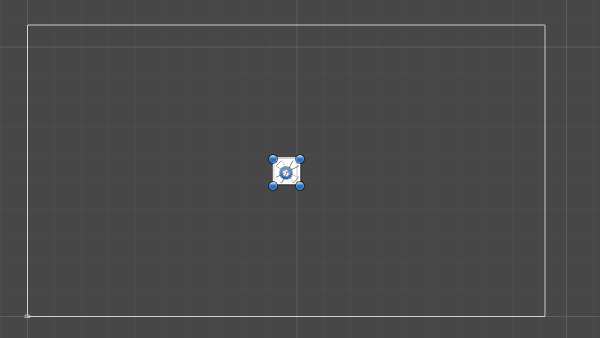

PlatinioTween
==============
Copyright (c) 2017 -2019 Unity Project by James Roman


What is this?
==============
This is a Unity3D Asset that let you create animations by code, and works very well animating UI, [here](https://www.youtube.com/watch?v=tv0UpQat9EA)  you can see a tutorial.

Getting started
==============
Just download and import [this](https://github.com/platinio/PlatinioTween/releases/download/1.52/PlatinioTween.1.52.unitypackage) 

and if you want to access directly the RectTransformHelper

```c#
using Platinio.UI;
```
and you are ready to go.

Creating a tween
==============
this scale a transform from his current scale to (10.0f , 10.0f , 10.0f) in 2 seconds.
```c#
transform.ScaleTween(Vector3.one * 10.0f , 2.0f);
```

Canceling a tween before it ends
==============

Sometimes you will like to cancel a tween before it ends, if that is the case the recommended  way is to set a GameObject as the owner, typically the GameObject creating the tween, and later use it to cancel the tween.

```c#
IEnumerator CO_TweenRoutine()
{
    gameObject.Move(Vector3.zero , 5.0f).SetOwner(gameObject);
    yield return new WaitForSeconds(2.5f);
     gameObject.CancelAllTweens();
}
```
This will cancel all the tweens associate to the current GameObject.

But if you want you can cancel it using the id.

```c#
IEnumerator CO_TweenRoutine()
{
    int id = gameObject.Move(Vector3.zero, 5.0f).id;
    yield return new WaitForSeconds(2.5f);
    gameObject.CancelTween(id);
}
```
this will do the same as cancel using the GameObject.

Using Eases
==============
The best way to explain a Ease is just to see it on action :)

```c#
transform.Move(Vector3.zero , 2.0f).SetEase(Ease.EaseOutElastic);
```
Will result in:


```c#
transform.Move(Vector3.zero , 2.0f).SetEase( Ease.EaseOutBounce);
```
Will result in:


Animating UI 
==============

Ok it is really usefull create tweens via code, but the real stuff is to create UI Animations, if you has been try it before then you know how hard it can be moving UI around because RectTransform positions are always relative to his anchor, so it means that.

```c#
rectTransform.anchoredPosition = new Vector2(100.0f , 100.0f);
```

is different for every single element that has different anchors configuration, one way to made it "works" is to use the same anchor position for every single element that we want to animate, but if you has been try it you know that it creates more problems.

So i made a function to convert any anchoredPosition for any RectTransform to a global coordinate system, so you can move stuff around as precise as you want without touching the anchors.

Use this as a guide to move stuff around inside a canvas.

     0.0 , 1.0 _______________________1.0 , 1.0
              |                      |
              |                      |                  
              |                      |
              |                      |
    0.0 , 0.0 |______________________| 1.0 , 0.0

Moving a Popup Example
==============
```c#
rectTransform.Move(new Vector2(0.5f , 0.5f), canvasRect, 0.5f).SetEase(Ease.EaseOutBounce);
```

So as we know from the previous guide (0.5 , 0.5) is the center of our canvas in the global coordinate system, so the previous code will result in.


And then mixing stuff you can get a little creative.


Being more precise
==============

When comes to animating UI, the precision is all what matters, so in order to be more precise, you can move UI elements using your own pivot, example:

```c#
rectTransform.Move(Vector2.one, canvas , 0.5f , PivotPreset.UpperRight);
```

So this code will produce this:



And you can even use a custom pivot.

```c#
rectTransform.Move(Vector2.one, canvas , 0.5f , new Vector2(0.5f , 0.8f));
```
More and More about Tweens
==============

Scaling
==============

```c#
transform.ScaleTween(Vector3.one * 10.0f , 2.0f);
```

```c#
transform.ScaleX(10.0f , 2.0f);
```

```c#
transform.ScaleAtSpeed(Vector3.one * 10.0f , 10.0f);
```

Rotating
==============

```c#
transform.RotateTween(Vector3.up, 90.0f , 10.0f);
```


Fading
==============

You can fade Images, CanvasGroup and Sprites 

```c#
//fade to 0.0f in 2 seconds
canvasGroup.FadeOut(2.0f);
```

```c#
//fade to 1.0f in 2 seconds
canvasGroup.FadeIn(2.0f);
```

Color
==============

You can use tween to change colors, moving slowly from Color A to Color B , or you can use directly Images or Sprites

```c#
sprite.ColorTween(color , 2.0f);
```

Moving
==============
at this point should be important to note, that all the tweens have a variant for use speed instead of time, very handy sometimes.

```c#
//move transform A to transform B in 2.0 seconds
transformA.Move(transformA , transformB, 2.0f);
```

```c#
//move transform A to transform B using a constant speed of 10.0
transformA.MoveAtSpeed(transformA , transformB, 10.0f);
```

Moving UI
==============

better read Animating UI Elements just scroll up.


We love to have control
==============
yes we love to have control for everything or at least we try, so you can do a lot of stuff in order to have more control over tweens.

SetEase
==============
Read Ease section at the start
```c#
transform.Move(Vector3.zero, 1.0f).SetEase(Ease.EaseInQuint);
```

SetEvent
==============
you can set events that will be called in a specified time of the animation.
```c#
//call do something just at the middle of the animation
transform.Move(Vector3.zero, 5.0f).SetEvent(DoSomething() , 5.0f / 2.0f);
```

SetOnComplete
==============
You can set a delegate to be called just at the end of the animation.
```c#
transform.Move(Vector3.zero, 1.0f).SetOnComplete(DoSomething());
```

SetDelay
==============
Set a delay at the start of the animation.
```c#
transform.Move(Vector3.zero, 1.0f).SetDelay(2.0f);
```

SetOnUpdate
==============
SetOnUpdate is little special, it depends on the tween you are calling and you can see how it updates every frame.
```c#
gameObject.Move(Vector3.zero , 1.0f).SetOnUpdate(delegate { Debug.Log("call every frame"); } );
```

Final
==============
If you are interested on this keep an eye on [This](https://github.com/platinio/UnityUIAnimationFramework), i am porting this code into the Unity Timeline so you can create UI animations using visual tools, how awesome would that be?
